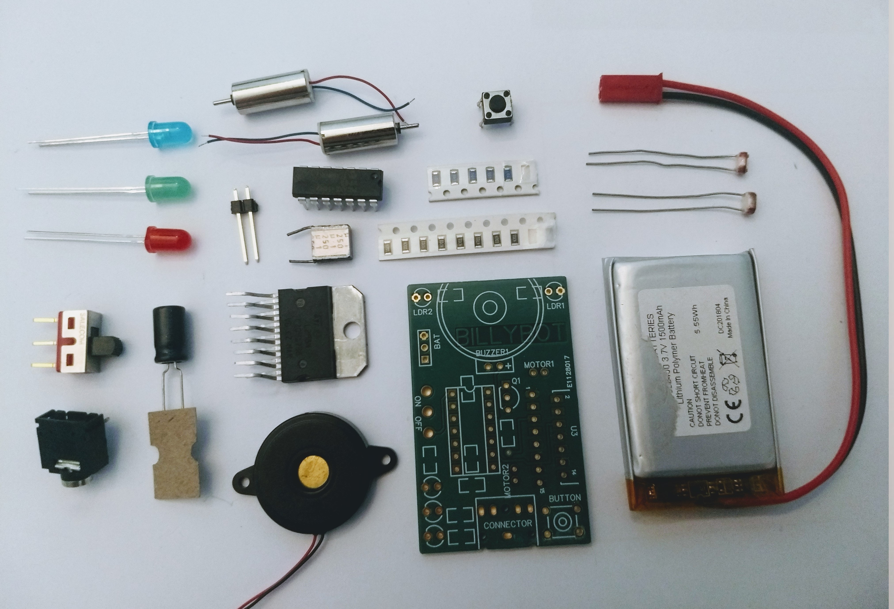
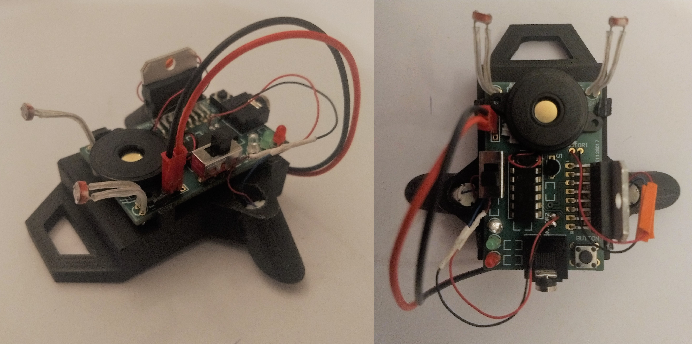

# Masterproef_Billybot

In deze masterproef wordt beschreven hoe een insect-robot voor STEM-onderwijs werd ontworpen en gebouwd. Deze robot is gebaseerd op de Sullibot en kreeg de naam: Billybot. De Billybot heeft als doel om jongeren op een interessante en interactieve manier te leren programmeren alsook te leren omgaan met technologie. Hiervoor wordt een Picaxe als microcontroller gebruikt die kan geprogrammeerd worden in de programmeeromgeving van Picaxe. Om de robot van energie te voorzien wordt gebruik gemaakt van een Lithium-ion batterij die kan worden opgeladen. Verder is de robot in staat om zich vooruit en achteruit te bewegen, ledlampjes te laten branden, geluid te maken via een piezo-element en kan de robot ook lichtinformatie uit zijn omgeving halen. Om verbinding te maken met een computer wordt gebruik gemaakt van een AUX-kabel. Deze masterproef omvat ook verschillende codevoorbeelden en een grondige test van de robot.

 

The device features the following main components:

* 3D printed frame
* Custom PCB
* Pickaxe microcontroller Pic14M2
* Lithium-ion Battery
* H-bridge for motor control
* AUX-conector

Schematic and PCB-layout were made in EasyEDA and can be found here: [EasyEDA Project](https://easyeda.com/cissedhoore/thesis)
 
Thesis describing the designing process and the tests that were performed with the resulting robot can be found here:  
 [Masters Scription (Univeristy of Ghent)](https://lib.ugent.be/nl/catalog/rug01:002786081)
